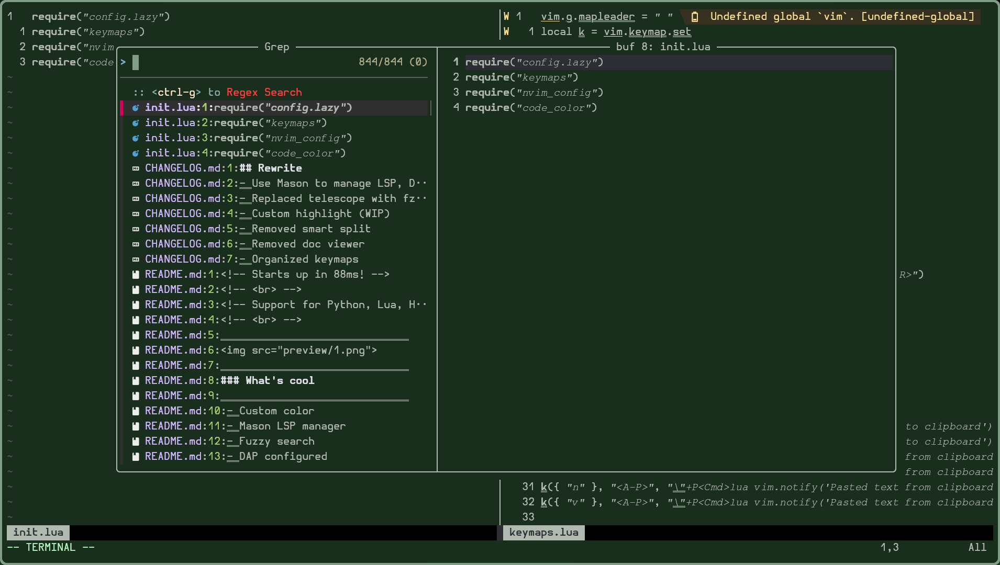

<!-- Starts up in 88ms! -->
<!-- <br> -->
<!-- Support for Python, Lua, HTML, Javascript, CSS, Bash, C++ -->
<!-- <br> -->



### What's cool

- Custom color
- Mason LSP manager
- Fuzzy search
- DAP configured

### Installation
```bash
git clone https://github.com/newor0599/nvim-conf
cd nvim-conf
./install.sh
```

